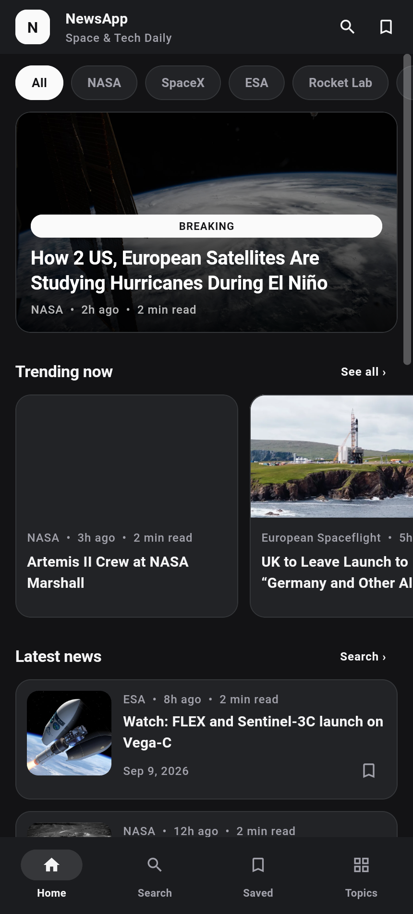
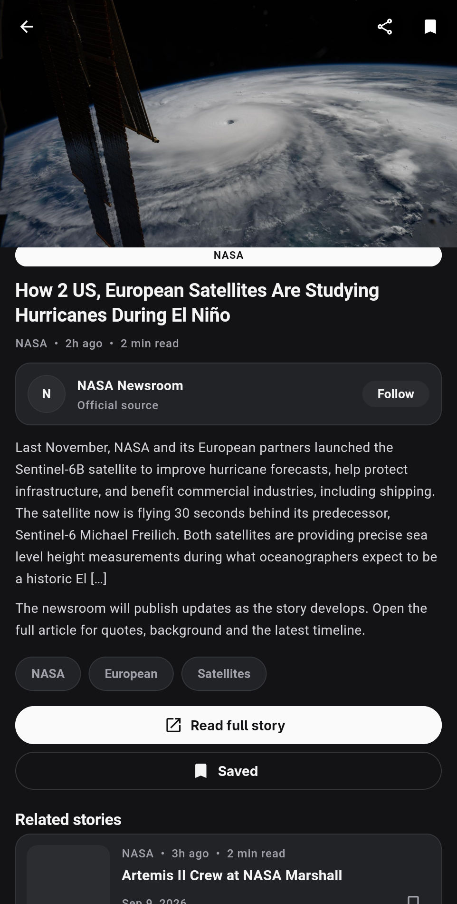
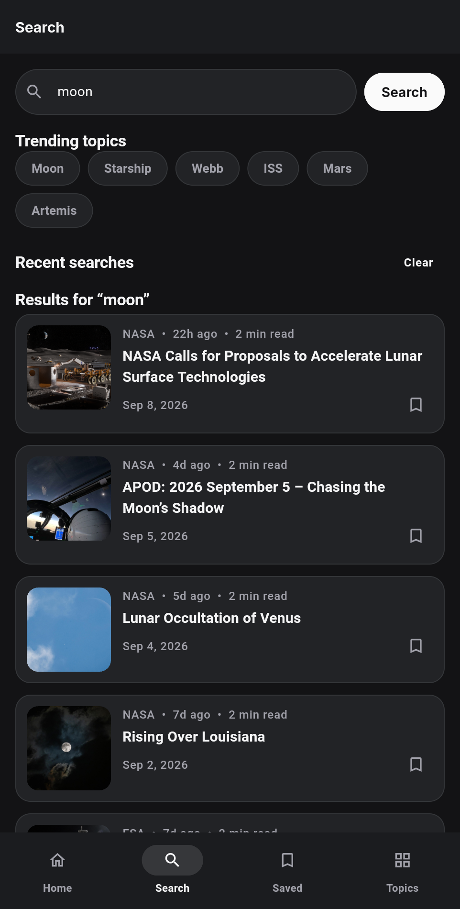
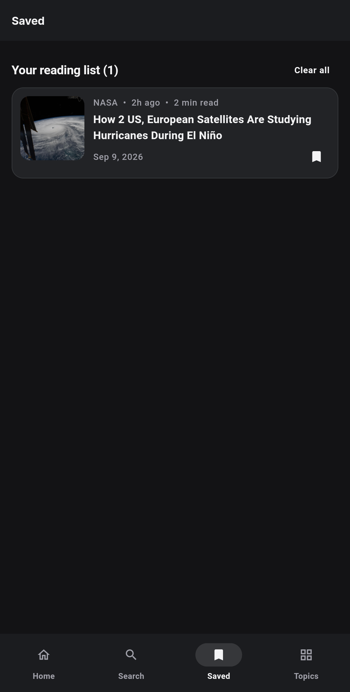
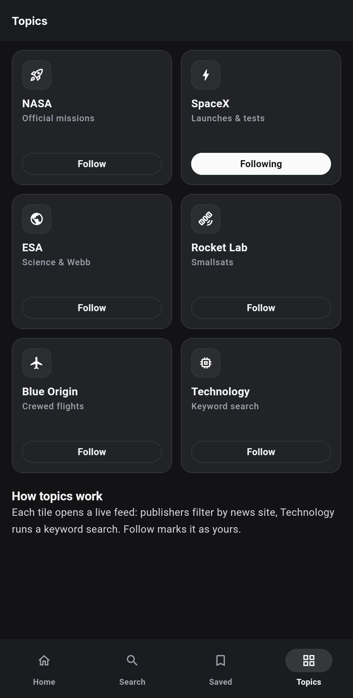

# NewsApp

A neutral dark-themed Flutter news reader powered by the free
[Spaceflight News API](https://api.spaceflightnewsapi.net/v4/docs/)
(no API key required).

## Preview

| Home | Article | Search |
| ---- | ------- | ------ |
|  |  |  |

| Saved | Topics |
| ----- | ------ |
|  |  |

## Features

- **Home** — breaking hero, trending rail, paginated latest feed with
  pull-to-refresh and per-publisher filters
- **Search** — live results, trending topics, persisted recent searches
- **Article** — full summary, followable source row, tappable tags that
  open live feeds, related stories, share sheet, open-in-browser
- **Saved** — persisted reading list with save/unsave feedback
- **Topics** — publisher grid with persisted follow states, live feeds

## Getting Started

Requirements: Flutter 3.47+ (Dart 3.13+).

```bash
flutter pub get
flutter run -d linux    # or: -d chrome / android / ios
```

Other useful commands:

```bash
dart analyze            # static analysis (clean)
flutter test            # unit + widget + golden regression tests
```

### Screenshot / golden tests

`test/preview_test.dart` renders all five screens against a mocked API
and compares `test/preview/*.png` goldens. Refresh them after UI changes:

```bash
flutter test --update-goldens test/preview_test.dart
```

The README previews in `screenshots/` are captured from the real app on
Linux (real API data, real fonts) — goldens use the test font fallback
and are for regression only.

## Project layout

```
lib/
  main.dart            # bootstrap: stores + API client + theme
  theme/app_theme.dart # neutral zinc tokens (mirrors design/css/tokens.css)
  models/article.dart  # Spaceflight API article model
  services/            # spaceflight_api, bookmarks_store, followed_sources, actions
  widgets/             # article_cards, common (badges, chips, states)
  screens/             # home, search, detail, saved, topics, app_shell
design/                # original static HTML/CSS prototype
```

Data: `GET https://api.spaceflightnewsapi.net/v4/articles/`
with `limit`, `offset`, `search`, `news_site` and `{id}` detail queries.
